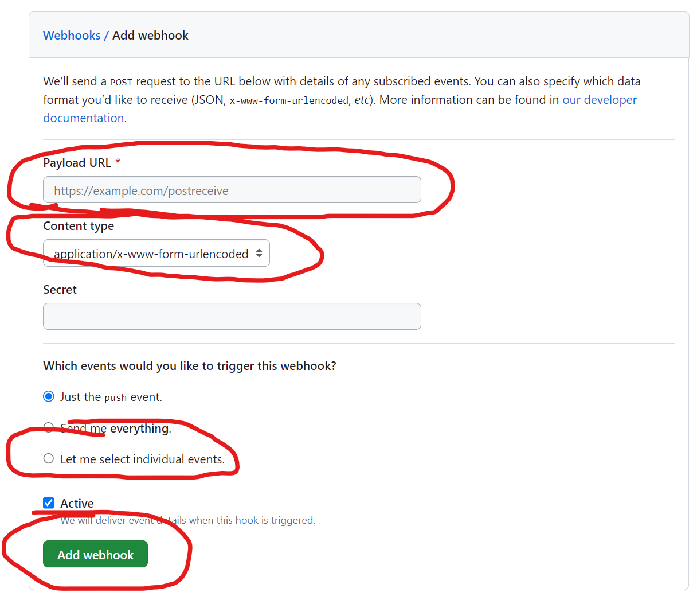
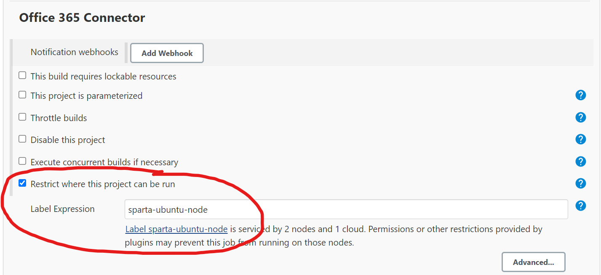
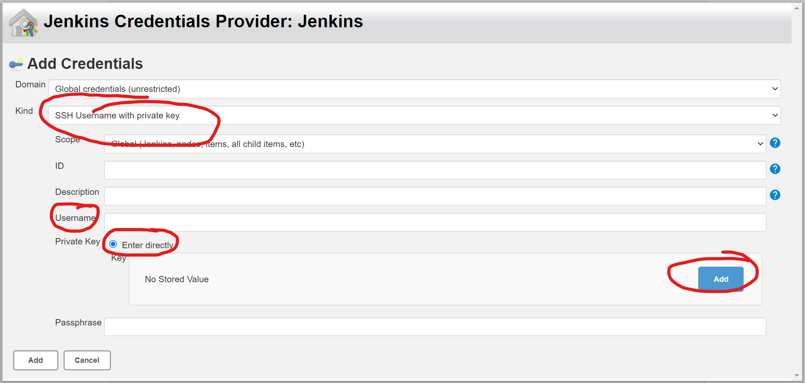
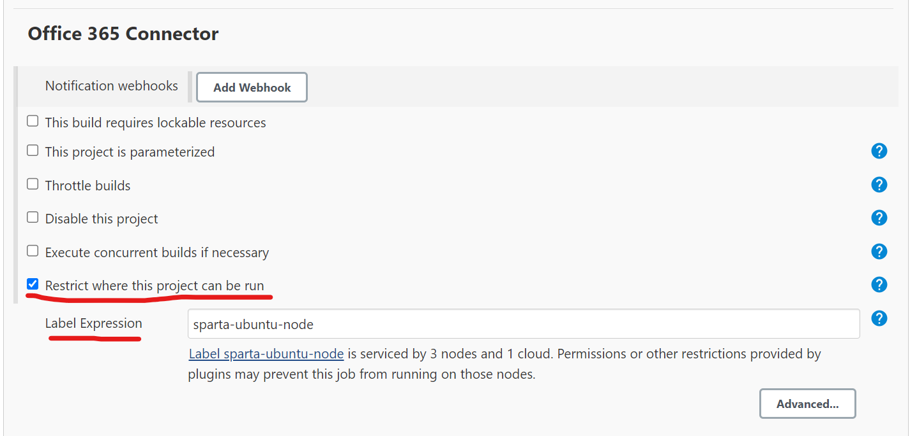

# The CI-CD process on Jenkins
This is a guide on how to create a CI-CD process for an app to run on an EC2 instance through Jenkins Pipeline

### Architecture Diagram


### Step 1. Connecting your local Git repository to GitHub.
1. Create a Git repository within the folder with all the app content
```
git init
```
2. Create a remote repository on GitHub
3. Connect your local repository to the GitHub repository
```
git remote add origin git@github.com:LukeWeller7/App_Folder.git
git branch -M main
```
4. Create a secondary branch, this is where any user changes will occur
```
git checkout -b dev
```
5. Once you have made any changes, you can push to GitHub. This concludes Step 1.
```
git add .
git commit -m "Commit Message"
git push -u origin dev
```

## Step 2. Setting up a Jenkins CI
This step is to set up a CI Job on Jenkins that will test the app whenever a new push is sent to GitHub. This ensures whether the changes to the app will work or not. If not an email response with error will be sent.
### Setting up the Webhook in GitHub
1. Go to your GitHub repository where you have saved your app folder.
2. Go to Settings for that repo
3. In the navigation tab, go to Webhooks
4. In Webhooks, select Add Webhook  

   1. Enter the payload URL: http://<Jenkins IP:8080>/github-webhook/ 
   2. Content Type - application/JSON 
   3. Select individual events from list - Pushes, Pull requests 
   4. Add Webhook  
   

### Creating Jenkins Job
1. Go to Jenkins and on the main page select New Item  

2. On the create new job page, complete the following:
   1. Enter the name of Job
   2. Select Freestyle 
   3. Select Ok  

3. General Tab
   1. Fill out the description 
   2. Select "Discard old builds"
   3. For "Max # of builds to keep", enter 3
   4. Select "GitHub project"
   5. For "Project URL", enter the HTTPS URL from your GitHub repo

4. Office 365 Connector
   1. Select "Restrict where this project can be run"
   2. For "Label Expression", enter the agent node you want to use

5. Source Code Management
   1. Select "Git"
   2. In "Repositories", for "Repository URL", enter the SSH URL from your GitHub repo
   3. For "Credentials", select "Add" to add your private key, if you have already done this, please select your ey name from the dropdown menu and skip step **iv**
   4. In the "Add" dropdown, select "Jenkins"
       1. For Kind, select "SSH username and private key"
       2. Username - use a naming convention
       3. Private Key - Enter Directly - Add - Enter your private SSH key linked to your GiHub repo

   5. For "Branch Specifier", enter */main  
   
6. Build Triggers
   1. Select "GitHub hook trigger for GITScm polling"
7. Build Environment
   1. Select "Provide Node & npm bin/ folder to PATH"  
   
8. Build
   1. Select "Add build step"
   2. From dropdown select "Execute Shell"
   3. In "Command", enter the commands to run
9. Apply
10. Save  


## Step 3. Setting up Jenkins Job to Merge repos
Now that we have a CI that will test the code to ensure it is working, we can now set up a post build that will merge the commits from the Dev branch into the Main branch, so it is ready to run.
### Creating CI Pipeline on Jenkins.
Here you can either re-create your CI Jenkins job or make the changes into you current Jenkins Job (If something isn't mentioned here unlike the other Job, that means it's not being used.)
1. Create a new Jenkins job
2. General
   1. Discard old builds
   2. Max # = 3
   3. GitHub project
   4. Project URL = HTTPS URL

3. Office 365 Connector
   1. Label Expression = Agent node

4. Source Code Management
   1. Git
   2. Repository URL = SSH URL
   3. Credentials = Private SSH Key
   4. Branch Specifier = dev

5. Build Triggers
   1. GitHub hook trigger
6. Build Environment
   1. Provide Node & npm

7. Build
   1. Add build step
   2. Execute Shell
   3. Command = test commands
8. Post-build Actions
   1. Add post-build action
   2. Build other projects
   3. Projects to build = merge job
   4. Trigger only if build is stable

9. Apply
10. Save


### Creating Merge Job on Jenkins
This Job will allow Jenkins to take the committed changes from the Dev repo and push it into the main repo on GitHub
1. Create a new Jenkins Job (Name the same as Post-build job name)
2. General
   1. Discard old builds
   2. Max # = 3
   3. GitHub project
   4. Project URL = HTTPS URL

3. Office 365 Connector
   1. Label Expression = Agent node

4. Source Code Management
   1. Git
   2. Repository URL = SSH URL
   3. Credentials = Private SSH Key
   4. Branch Specifier = dev
   5. Add
   6. Merge before build
   7. Name of repository = origin
   8. Branch to merge to = main

5. Build Environment
   1. SSH Agent
   2. file.pem

6. Post-build Actions
   1. Add post-build action
   2. Git publisher
   3. Merge Results
7. Apply
8. Save


### Merging on GitHub
This step is to make sure that the merge request into GitHub is automated.
1. Go to your repo on GitHub
2. Go to repo settings
3. Select General

4. Scroll down to pull requests
5. Select Allow auto-merge


## Step 4. Creating a Jenkins CD Job.
For this we need to create a Jenkins Job that will take go into the EC2 instance and create two Virtual Machines, Database, and App which will be ready to Run

### Creating the Database VM
- Ubuntu 18.04 LTS 1e9
- SSH in to instance (-y)
- Update & Upgrade
- Get and install correct version of mongodb
- Change the BindIP to 0.0.0.0
- Systemctl Start mongod
- Systemctl Enable mongod

### Creating the App VM
- Ubuntu 18.04 LTS 1e9
- SSH into instance (-y)
- Update & Upgrade
- Install, start, and enable nginx
- Set-up reverse Proxy (port 3000)
- Restart nginx
- Install the correct version on Nodejs (12)
- npm install pm2 -g
- export DB_HOST=mongodb://<app public ID>:27017/posts
- Git clone main branch repo
- cd into app folder
- npm install 
- node app.js

## Step 5. (Optional) Manually Logging in to Instances to test they are set-up properly
Now that the instances are set-up, we will still want to access both of them to ensure that Jenkins set them up as the way we intended.

### Database VM
- SSH in
- sudo nano /etc/mongod.conf
- Check the BindIP
- sudo systemctl status mongod
- Check that it is running

### App VM
- SSH in
- sudo nano /etc/nginx/sites-available/default
- Check the reverse proxy is set correctly
- sudo systemctl status nginx
- Check that nginx is running
- printenv DB_HOST 
- Check the DB_HOST is set correctly


### Check the App Webpage
- Enter the IP address and ensure that the homepage is present
- your_name Sparta is on the screen
- check /posts


# Notes on CI-CD

### What is CI-CD?
Continuous Integration & Continuous Delivery/Deployment
- CI - Source and Build - Developers commit code multiple times a day, fully auto with test process giving fast feedback
- CD (Delivery) - Source, Build, Test, Production - continued from CI, ensuring new changes are released to customers quickly and sustainable.
- CD (Deployment) - Source, Build, Test, Production - automates who process sp when all stages are passed, new changes are released automatically

The main difference between Continuous Delivery and Deployment is that with delivery, the production release is done manually

### Why use CI-CD?

- The main reason to use CICD, is to provide automation to the system which will provide fast releases, leading to cost efficiency.
- Faster software builds
- customer satisfaction
- fault isolations simpler and quicker (easy to find issues with code)

### What is jenkins?

- Jenkins is an open source automation server.
- Java-based program working with Windows, macOS, & Linux.

### Why use Jenkins?

- Open-Source
- Easy-to-use
- AWS, netflix, HMRC, Home Offic, NASA, use it. Even though they can afford any software, they go with Jenkins which is free (Key point - Open-Sourcew)

### What are the Stages to Jenkins?

1. Create a Jenkins Job
2. Build a Pipeline in Jenkins
3. Link the Jobs in Jenkins

### Alternatives to Jenkins

- **circleci** (only supports Linux and macOS)
- **Teamcity** (More supported OS) (On Prem only)
- **Bamboo** (one off payment)
- **GitLab**

They are provide more built-in features
None of these are open-source as well as you have to pay for build agent license price
