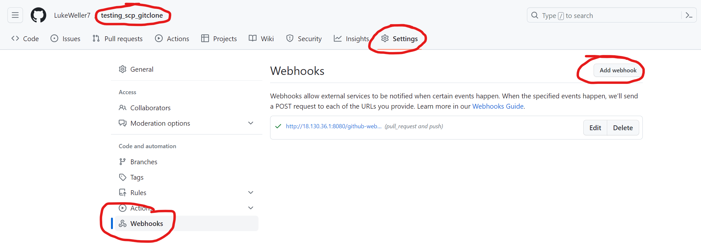
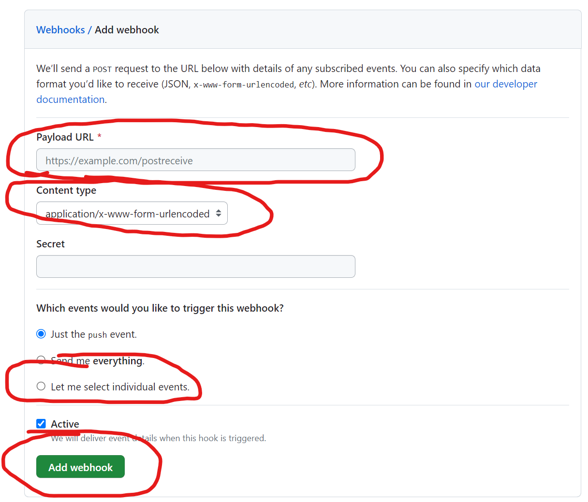
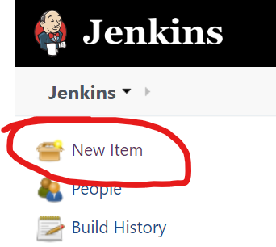
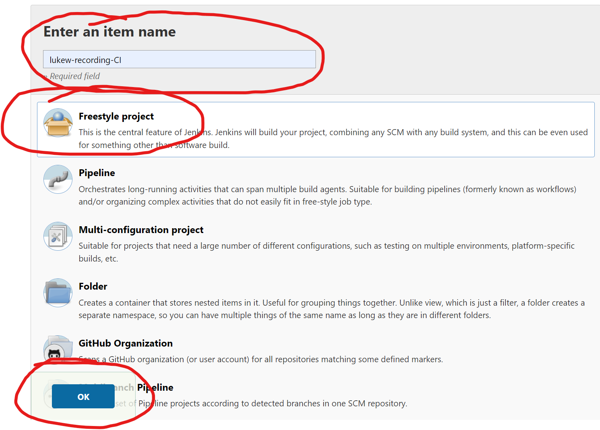
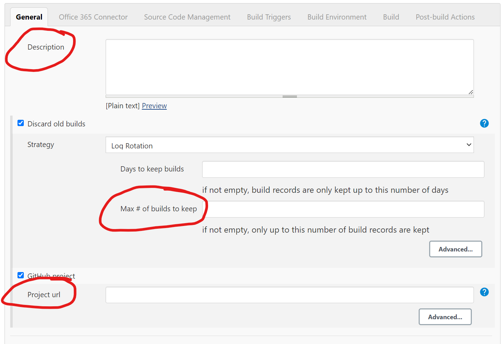
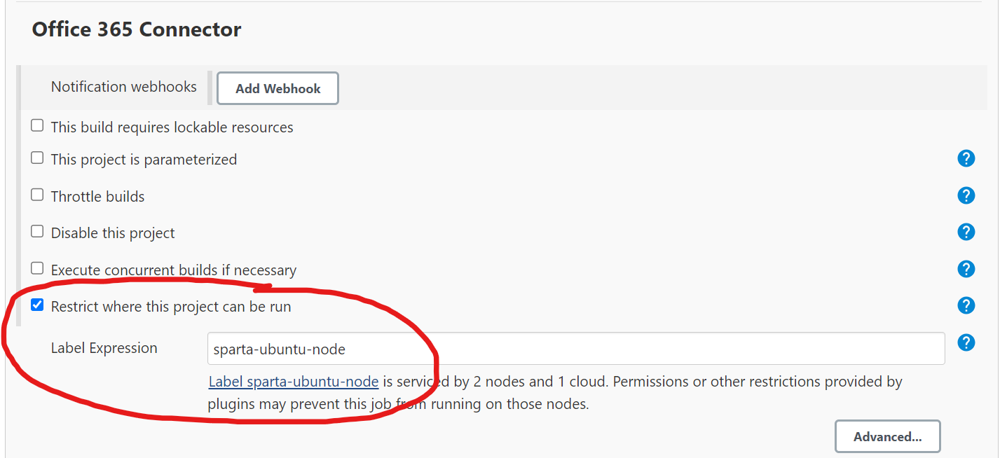
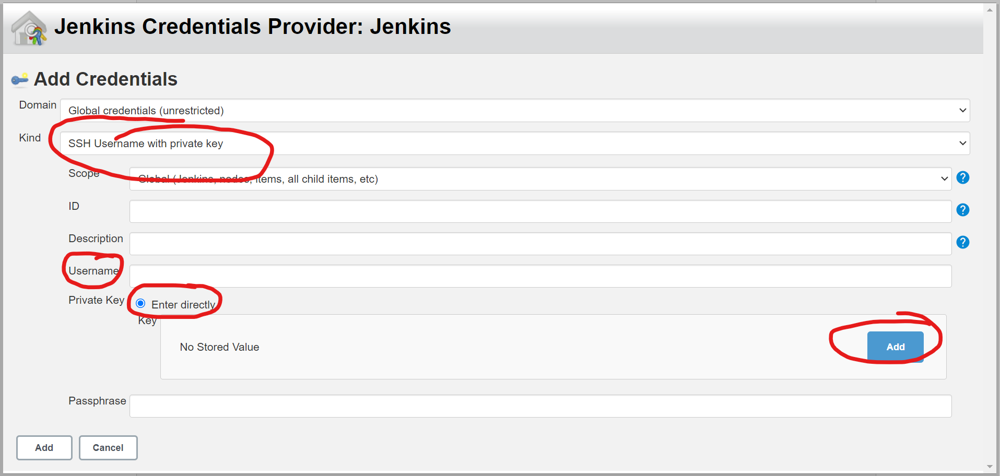
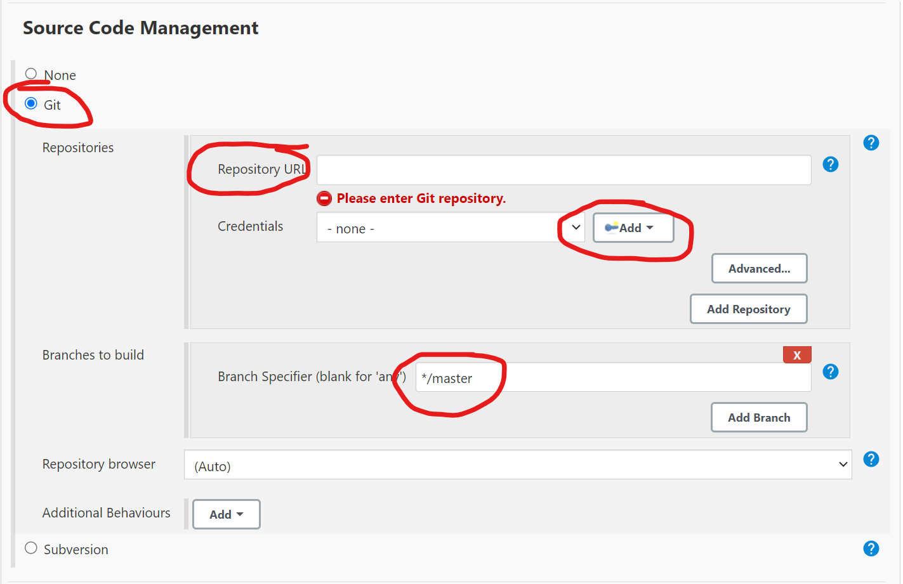
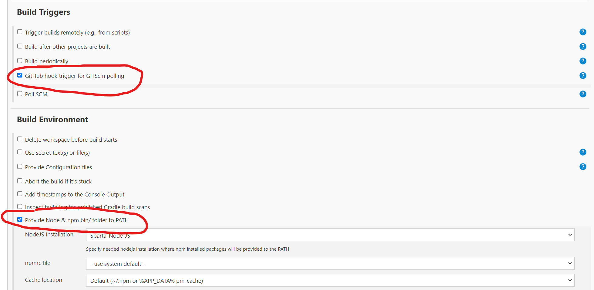
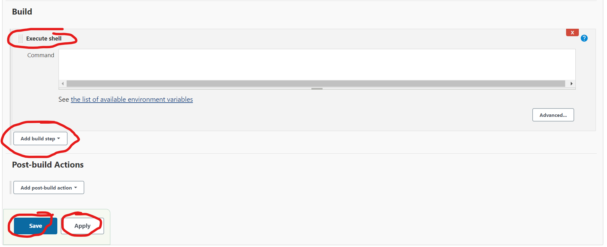

# Guide on how to create a Webhook between GitHub and Jenkins

### Setting up the Webhook in GitHub
1. Go to your GitHub repository where you have saved your apps folder.
2. Go to Settings for that repo
3. In the navigation tab, go to Webhooks
4. In Webhooks, select Add Webhook  

5. Enter the payload URL: http://<Jenkins IP:8080>/github-webhook/ 
6. Content Type - application/JSON
7. Select individual events from list - Pushes, Pull requests
8. Add Webhook  

### Creating Jenkins Job
1. Go to Jenkins and on the main page select New Item  

2. On the create new job page, complete the following:
   1. Enter the name of Job
   2. Select Freestyle 
   3. Select Ok  

3. General Tab
   1. Fill out the description 
   2. Select "Discard old builds"
   3. For "Max # of builds to keep", enter 3
   4. Select "GitHub project"
   5. For "Project URL", enter the HTTPS URL from your GitHub repo

4. Office 365 Connector
   1. Select "Restrict where this project can be run"
   2. For "Label Expression", enter the agent node you want to use

5. Source Code Management
   1. Select "Git"
   2. In "Repositories", for "Repository URL", enter the SSH URL from your GitHub repo
   3. For "Credentials", select "Add" to add your private key, if you have already done this, please select your ey name from the dropdown menu and skip step **iv**
   4. In the "Add" dropdown, select "Jenkins"
       1. For Kind, select "SSH username and private key"
       2. Username - use a naming convention
       3. Private Key - Enter Directly - Add - Enter your private SSH key linked to your GiHub repo

   5. For "Branch Specifier", enter */main  
   
6. Build Triggers
   1. Select "GitHub hook trigger for GITScm polling"
7. Build Environment
   1. Select "Provide Node & npm bin/ folder to PATH"  
   
8. Build
   1. Select "Add build step"
   2. From dropdown select "Execute Shell"
   3. In "Command", enter the commands to run
9. Apply
10. Save  

