# This is a Guide on how to set up a CI and GitHub merge through Jenkins.
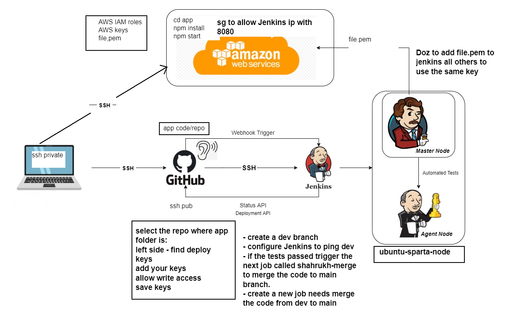
### Creating CI Pipeline on Jenkins.
1. Create a new Jenkins job
2. General
   1. Discard old builds
   2. Max # = 3
   3. GitHub project
   4. Project URL = HTTPS URL
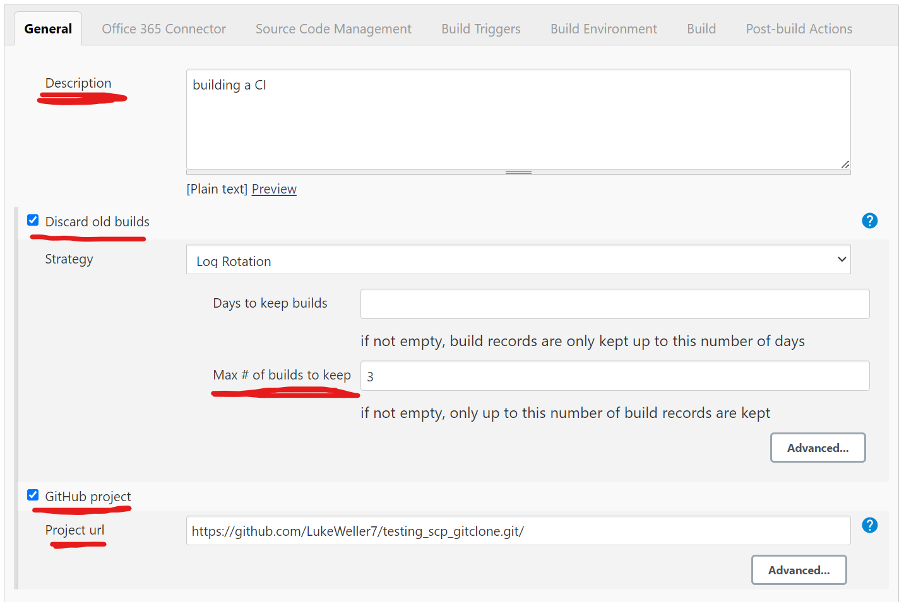
3. Office 365 Connector
   1. Label Expression = Agent node
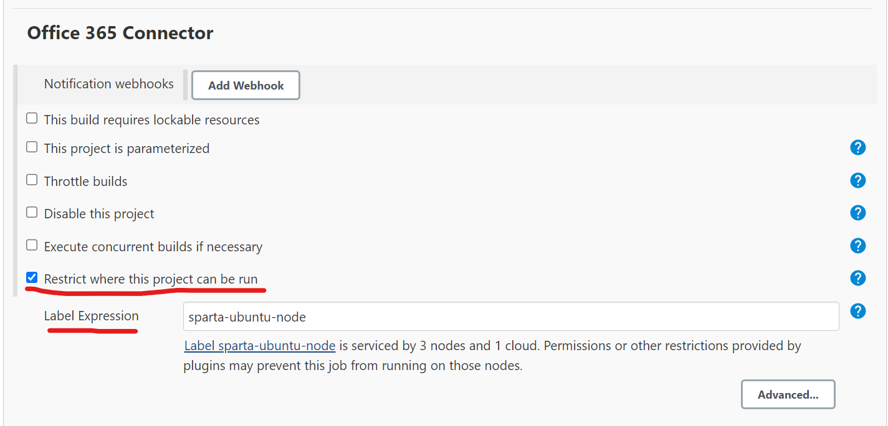
4. Source Code Management
   1. Git
   2. Repository URL = SSH URL
   3. Credentials = Private SSH Key
   4. Branch Specifier = dev
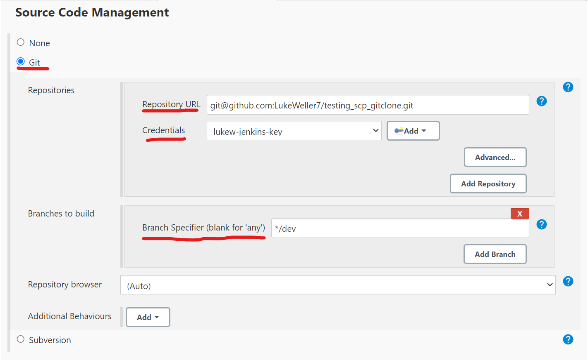
5. Build Triggers
   1. GitHub hook trigger
6. Build Environment
   1. Provide Node & npm
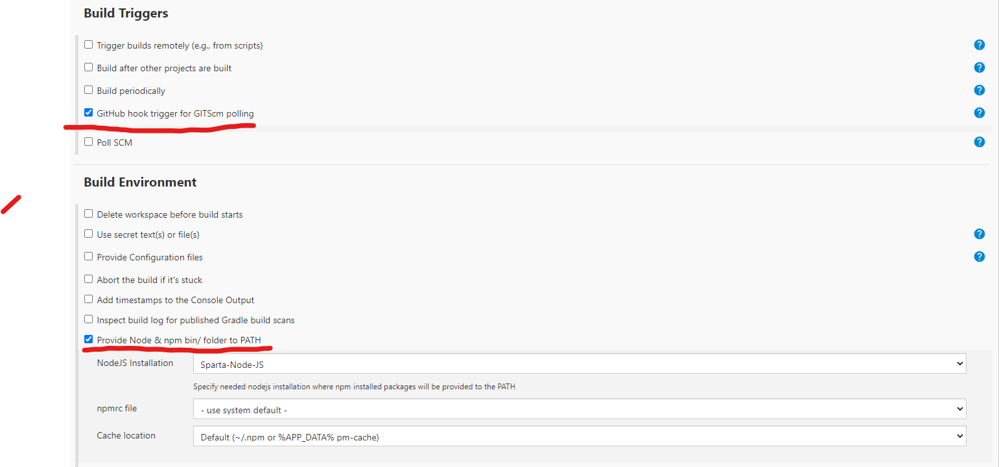
7. Build
   1. Add build step
   2. Execute Shell
   3. Command = test commands
8. Post-build Actions
   1. Add post-build action
   2. Build other projects
   3. Projects to build = merge job
   4. Trigger only if build is stable
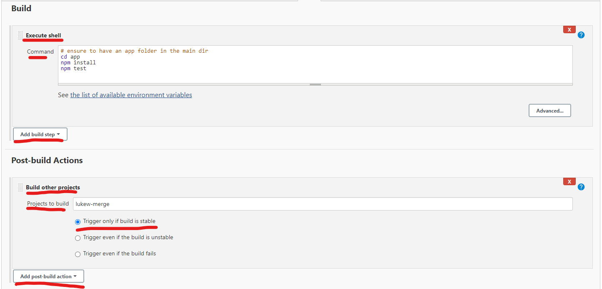
9. Apply
10. Save

### Creating Merge Job on Jenkins
1. Create a new Jenkins Job (Name the same as Post-build job name)
2. General
   1. Discard old builds
   2. Max # = 3
   3. GitHub project
   4. Project URL = HTTPS URL
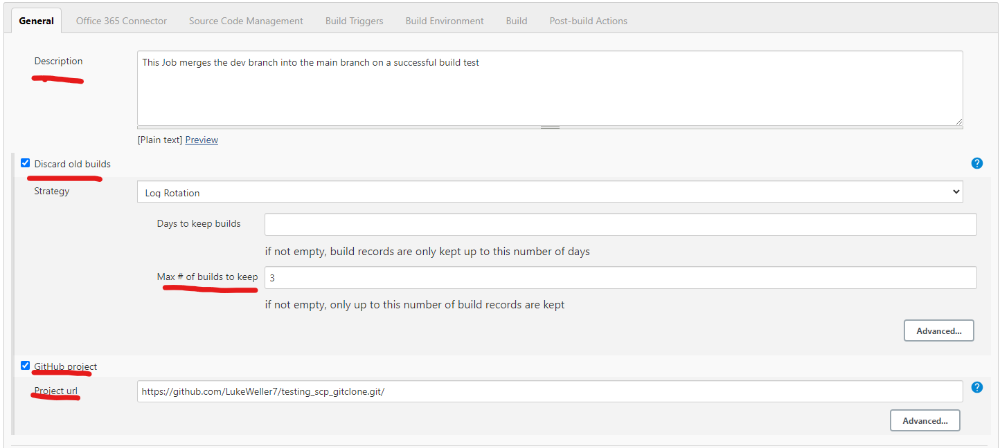
3. Office 365 Connector
   1. Label Expression = Agent node
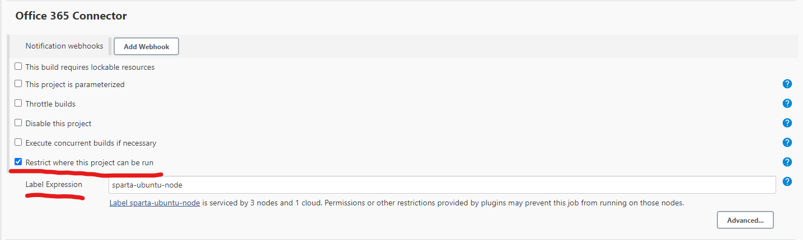
4. Source Code Management
   1. Git
   2. Repository URL = SSH URL
   3. Credentials = Private SSH Key
   4. Branch Specifier = dev
   5. Add
   6. Merge before build
   7. Name of repository = origin
   8. Branch to merge to = main
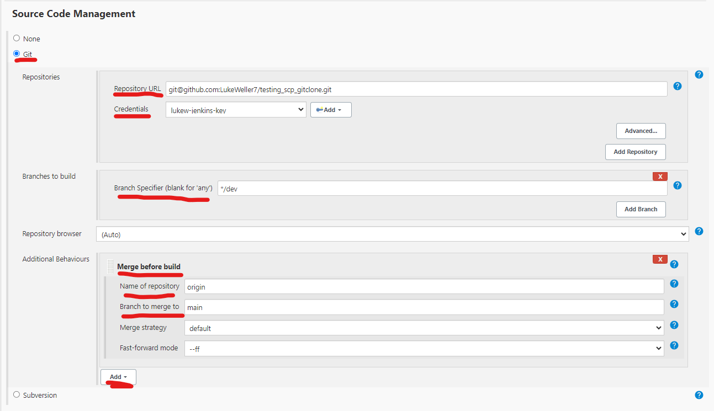
5. Build Environment
   1. SSH Agent
   2. file.pem
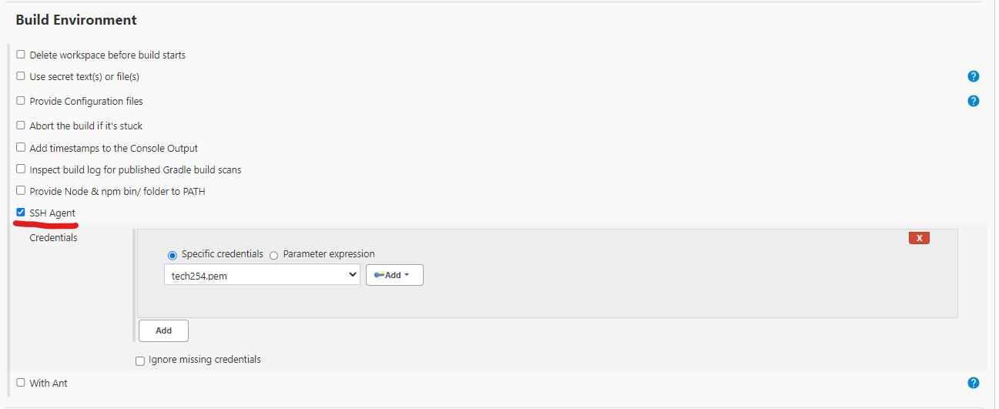
6. Post-build Actions
   1. Add post-build action
   2. Git publisher
   3. Merge Results
7. Apply
8. Save
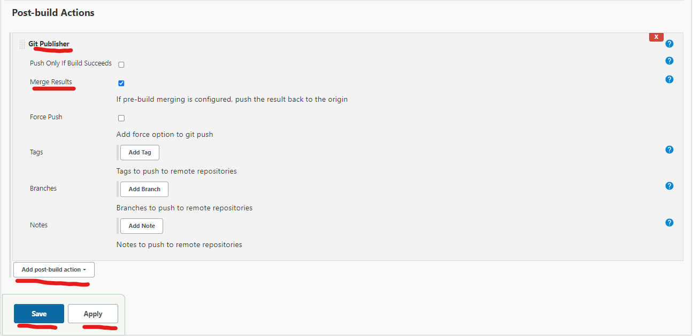

### Merging on GitHub
1. Go to your repo on GitHub
2. Go to repo settings
3. Select General
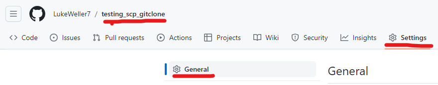
4. Scroll down to pull requests
5. Select Allow auto-merge
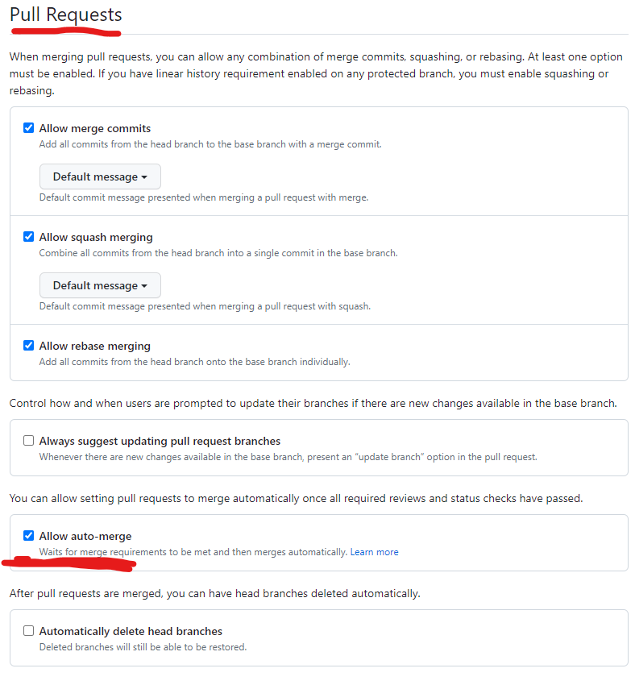

### List of Potential blockers
- SSH key on GitHub is set to read only
- Not on the correct branch in Git
- Selected Push only if build success on merge job when no build is present.
- Ensure allow auto-merge is selected
- 
