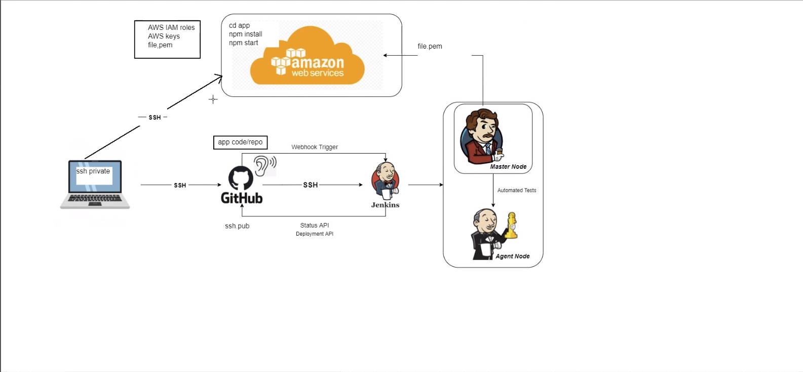

# How are we using CI-CD/Jenkins?



- Starts from local host
- app folder available locally 
- we all know how to deploy the app folder, scp, run the app and deploy to webpage. 
- EC2, ASG, VPC, all done but manually, how to automate the deployment, this is to save time. 
- We help the business release the updates faster. 
- The aim is to get the code from locally to AWS automatically in one click.

### Rough steps to using Jenkins
1. Code starts locally
2. ssh key to github
3. Code needs to travel to automation server  (Jenkins)
4. From Github to jenkins from webhook trigger (Gitclone)
5. Code needs to be tested (python -manually) (jenkins - auto)
6. In Jenkins, on the master node (vm), it will automate code through agent node (build test)
7. If test past, results sent back to master node, if not passes, errors sent to developers
8. If the agent node fails, till a copy on master node.
9. Cannot be passed on if failed, if it's small syntax, attempt to fix if confident, if more needed, send back to developer.
10. This process is CI


### Log in to Jenkins
1. Set up host server with port 8080 for jenkins
2. access the webpage http://localhostIP:8080/
3. Enter Username details
4. Enter Password
5. Log in

### Creating a new Job
1. In the Jenkins main dashboard
2. New Item (Navigation bar, top left)
3. name (use a naming convention) example: lukew-first-job
4. Select "Freestyle project"
5. Select "Ok"
6. Description - Write out the purpose of this job
7. Check the box "Discard old builds"
8. "Max # of builds to keep" - 3 (This determines how many versions of the job are saved from most recent)
9. "Build" - "Add build" - "Execute shell" (This allows you to enter a shell command script)
10. Enter your commands
```
whoami
uname -a
```
11. Select, "Apply"
12. Select, "Save"

### How to run the job
1. Find your Job
2. Dropdown next to the job name - "Build now" (This runs the job for you)
3. Select YOUR job
4. Select, "Build History" (This will show you all the build runs that have occured)
5. Select History number most recent (Highest Number) and select dropdown - "Console Output"
6. View the results from the shell script

### Configure already made jobs
1. Select your job 
2. Configure (to make any changes)

### Continuation Job
1. In job
2. Configure
3. Post-build Actions
4. Trigger only if build is stable

### Additional notes
- On the Jenkins main page, you an view all the Jobs.
  - The first column will present a colour depending on the test return
    - Blue: Success
    - Red: Failed
    - Grey: Untested
  - Next will be a weather symbol, this is dependant of the ratio of successful test runs
    - Sunny: 100%
    - Thunder: 0%
    - Partial Cloudy: Some fails, some Success
    - Rainy: 0%<
    - Cloudy: 50%
  - You will also find three columns showing the last time since, test pass, test fail and time taken to run test.
